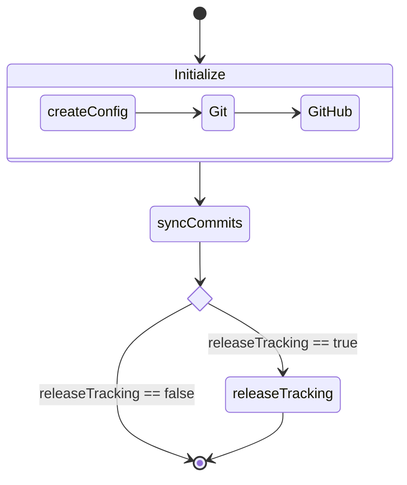

# Contributing to Yuki-no

Thank you for your interest in contributing to Yuki-no! This guide will help you get started.

## Development Setup

### Prerequisites

- Node.js v22.0.0 or higher
- [Yarn Classic](https://classic.yarnpkg.com/lang/en/) (install via [Node Corepack](https://nodejs.org/api/corepack.html))
  ```bash
  corepack enable
  ```
- GitHub account
- An upstream repository
- GitHub Personal Access Token (Fine-grained)

### Setting up GitHub Fine-grained PAT

> [!WARNING]
>
> **Important Notes**
>
> - Never share your PAT with anyone
> - Use Fine-grained PAT instead of Classic PAT for better permission control

1. [Create a new Fine-grained PAT](https://github.com/settings/personal-access-tokens/new)
2. Repository access settings:
   - Select "Only select repositories"
   - Choose your upstream repository
3. Repository Permissions:
   - Contents: Read and write
   - Issues: Read and write (needed for release tracking)
   - Metadata: Read (set automatically)

For more details, see [GitHub documentation](https://docs.github.com/en/authentication/keeping-your-account-and-data-secure/managing-your-personal-access-tokens).

### Local Environment Setup

> [!WARNING]
>
> **Important Notes**
>
> - The `.env` file is in .gitignore by default
> - Never commit the `.env` file to git

1. [Fork](https://github.com/Gumball12/yuki-no/fork) and clone the repository

   ```bash
   git clone https://github.com/Gumball12/yuki-no.git
   cd yuki-no

   # Install dependencies
   yarn install
   ```

2. Create `.env` file in the project root

   ```.env
   ACCESS_TOKEN=your_pat_here
   USER_NAME=your_github_username
   EMAIL=your_github_email
   HEAD_REPO=https://github.com/head_username/head_repo.git
   UPSTREAM_REPO=https://github.com/your_username/your_repo.git
   TRACK_FROM=head_commit_hash

   # ...
   ```

   > [!IMPORTANT]
   > For local development, you must set `UPSTREAM_REPO` explicitly.
   > The automatic repository detection only works in GitHub Actions.

For more environment variables, see [README](./README.md#configuration).

### Development Workflow

1. Create a new branch for your changes:

```bash
git checkout -b feat/your-feature
```

2. Run tests and the application:

```bash
yarn test # unit tests
yarn start:dev # run script
```

3. Format your code:

```bash
yarn lint
```

4. Commit your changes following [Conventional Commits](https://www.conventionalcommits.org/):

```bash
git commit -m "feat: add new feature"
git commit -m "fix: resolve issue #123"
```

5. Push your changes and create a pull request!

### Troubleshooting

#### Common Issues

If you find bugs not covered here, please [open an issue](https://github.com/Gumball12/yuki-no/issues).

**GitHub API 403 Errors**:

- Check your PAT permissions

## Project Structure

```
src/
├── index.ts           # Entry point
├── createConfig.ts    # Configuration setup and validation
├── utils.ts           # Utility functions
├── git/               # Git operations
├── github/            # GitHub API interactions
├── releaseTracking/   # Release tracking functionality
└── tests/             # Unit tests
```

### Flow

The diagram below shows the execution flow of Yuki-no:



1. **Initialize**: Sets up the configuration and initializes Git and GitHub clients
2. **syncCommits**: Synchronizes commits from the head repository to issues
3. **releaseTracking**: When enabled, updates issues with release information

## Testing

The project uses [Vitest](https://vitest.dev/) for testing. Tests are in the `src/tests/` directory.

### Running Tests

To run tests with coverage:

```bash
yarn test
```

### About Mocking

We generally recommend avoiding excessive mocking in tests. However, for operations with side-effects that aren't directly related to what you're testing, mocking is appropriate:

- Network requests to external services (e.g. GitHub API)
- File system operations (creating/deleting files, like Git)
- Other operations with unpredictable results

External libraries without side-effects should **not** be mocked. These libraries are typically well-tested already, and as long as their version remains consistent, they won't introduce unexpected behavior.

For similar reasons, most mocked behaviors are excluded from our test coverage metrics. Currently, we only have [mockedRequests.test.ts](./src/tests/mockedRequests.test.ts) for testing GitHub API interactions while maintaining idempotence.

When mocking is necessary, follow these practices:

- Mock only the specific functions needed
- Keep mocks as close to real behavior as possible
- Reset mocks between tests using `vi.clearAllMocks()`

## Getting Help

If you need help:

1. Check existing issues and docs
2. Open a new issue with a clear description

## License

By contributing, you agree that your contributions will be licensed under the MIT License. See [LICENSE](LICENSE) for details.

## E2E Testing

E2E tests verify the entire workflow by running the action against real GitHub repositories. Unlike unit tests, these tests use actual GitHub API calls without mocking.

### Test Structure

```
src/e2e/
├── helpers/
│   ├── env.ts        # Environment variable validation
│   ├── fixture.ts    # Test setup and cleanup utilities
│   ├── github.ts     # GitHub API helpers (Octokit wrapper)
│   └── spawn.ts      # Action execution helper
└── scenarios/
    └── *.e2e.test.ts # Test scenarios
```

Key components:

- **helpers/env.ts**: Validates required environment variables (`E2E_ACCESS_TOKEN`, `HEAD_REPO`, `UPSTREAM_REPO`)
- **helpers/fixture.ts**: Provides `setup()`, `cleanup()`, `withBranch()`, and `makeCommits()` functions
- **helpers/github.ts**: GitHub API operations (create/delete branches, issues, tags)
- **helpers/spawn.ts**: Executes the action with custom environment variables
- **scenarios/**: Individual test cases that simulate real-world usage

### Prerequisites

E2E tests require two GitHub repositories:

1. **HEAD_REPO**: Source repository to track changes from
2. **UPSTREAM_REPO**: Target repository where issues will be created

Update your `.env` file:

```env
E2E_ACCESS_TOKEN=your_pat_with_repo_access
HEAD_REPO=https://github.com/your-username/test-head-repo.git
UPSTREAM_REPO=https://github.com/your-username/test-upstream-repo.git
```

> [!WARNING]
>
> **Important Notes**
>
> - E2E tests use **real GitHub API calls** and create actual branches/issues
> - Tests automatically clean up created resources, but failures may leave artifacts
> - Be mindful of GitHub API rate limits (typically 5,000 requests/hour)
> - Use separate test repositories to avoid conflicts with production data

### Running E2E Tests

```bash
yarn test:e2e
```

**Test configuration** (`vitest.e2e.config.ts`):

- Runs sequentially (single thread) to prevent conflicts
- 3-minute timeout per test
- No coverage reporting
- Automatically loads `.env` file

**Expected behavior:**

- Creates temporary branches with `e2e/<uuid>` prefix
- Creates test commits in the head repository
- Executes the action and verifies issue creation
- Cleans up branches and closes created issues
