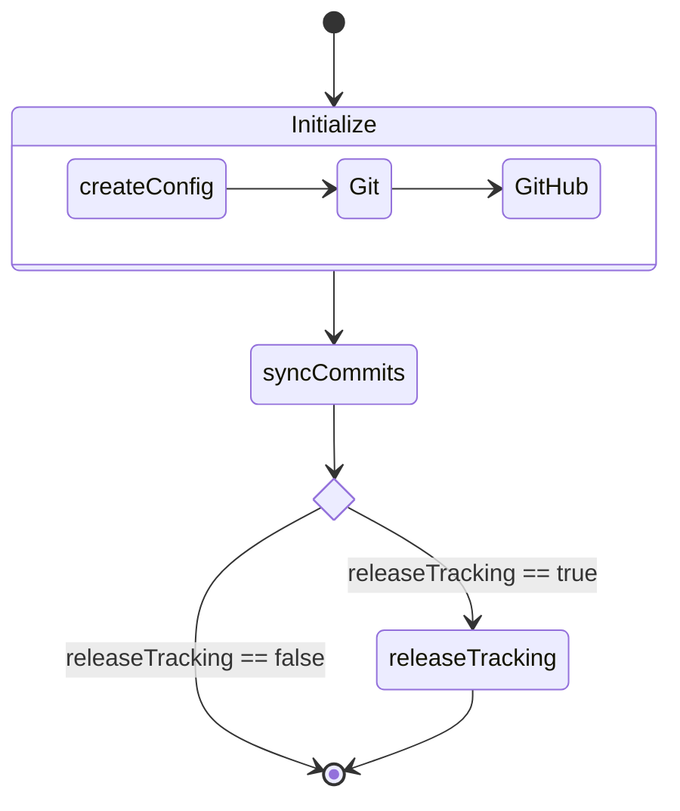

# Contributing to Yuki-no

Thank you for your interest in contributing to Yuki-no! This guide will help you get started.

## Development Setup

### Prerequisites

- Node.js v22.0.0 or higher
- [Yarn Classic](https://classic.yarnpkg.com/lang/en/) (install via [Node Corepack](https://nodejs.org/api/corepack.html))
  ```bash
  corepack enable
  ```
- GitHub account
- An upstream repository
- GitHub Personal Access Token (Fine-grained)

### Setting up GitHub Fine-grained PAT

> [!WARNING]
>
> **Important Notes**
>
> - Never share your PAT with anyone
> - Use Fine-grained PAT instead of Classic PAT for better permission control

1. [Create a new Fine-grained PAT](https://github.com/settings/personal-access-tokens/new)
2. Repository access settings:
   - Select "Only select repositories"
   - Choose your **head and upstream** repositories
3. Repository Permissions:
   - Contents: Read and write
   - Issues: Read and write (needed for release tracking)
   - Metadata: Read (set automatically)

For more details, see [GitHub documentation](https://docs.github.com/en/authentication/keeping-your-account-and-data-secure/managing-your-personal-access-tokens).

### Local Environment Setup

> [!WARNING]
>
> **Important Notes**
>
> - The `.env` file is in .gitignore by default
> - Never commit the `.env` file to git

1. [Fork](https://github.com/Gumball12/yuki-no/fork) and clone the repository

   ```bash
   git clone https://github.com/Gumball12/yuki-no.git
   cd yuki-no

   # Install dependencies
   yarn install
   ```

2. Create `.env` file in the project root

   ```.env
   ACCESS_TOKEN=your_pat_here
   USER_NAME=your_github_username
   EMAIL=your_github_email
   HEAD_REPO=https://github.com/head_username/head_repo.git
   HEAD_REPO_BRANCH=main
   UPSTREAM_REPO=https://github.com/your_username/your_repo.git
   TRACK_FROM=head_commit_hash
   # VERBOSE=true  # optional: show info/success logs locally

   # ...
   ```

   > [!IMPORTANT]
   > For local development, you must set `UPSTREAM_REPO` explicitly.
   > The automatic repository detection only works in GitHub Actions.

For more environment variables, see [README](./README.md#configuration).

### Development Workflow

1. Create a new branch for your changes:

```bash
git checkout -b feat/your-feature
```

2. Run tests and the application:

```bash
yarn test      # run all tests (unit & integration)
yarn test:unit # run unit tests
yarn test:integration  # run integration tests
yarn start:dev # run script w/ local .env file
```

3. Format your code:

```bash
yarn lint # type-check + Prettier format (writes changes for **/*.ts)
```

4. Commit your changes following [Conventional Commits](https://www.conventionalcommits.org/):

### Code Style Guidelines

- Prefer arrow functions for module-level utilities, callbacks, and most helpers.
  - Exceptions: class methods (prototype syntax), constructors, generators (function\*), and when top-level hoisting is strictly required.
- Control structures must use block statements with braces on their own lines (if/else, for/for...of/in, while, do...while).
- Organize files top-down: imports → public types/constants → public API → private/internal helpers (bottom).
- Use exactly one blank line to separate logical blocks; avoid multiple consecutive blank lines.
- Type safety: Do not use the TypeScript `any` type; prefer `unknown` with narrowing.
- Formatting:
  - Prettier is used with @trivago/prettier-plugin-sort-imports to keep imports ordered.
  - Run `yarn lint` to type-check and format TypeScript files (writes changes).
- Logging: Set `VERBOSE=true` to enable info/success log output locally.
- Tests:
  - Integration tests use Nock and run offline (no real network calls).
  - `src/tests/mockedRequests.test.ts` runs only in CI for the upstream repo with `MOCKED_REQUEST_TEST` auth; locally it is skipped.
- Permissions:
  - If workflows fail with `403 "Resource not accessible by integration"`, ensure repository "Workflow permissions" are set to "Read and write permissions" (Settings → Actions → General).

```bash
git commit -m "feat: add new feature"
git commit -m "fix: resolve issue #123"
```

### Validation (Zod)

- Environment variables are validated by Zod: see `src/validation/env.ts`.
- Required variables produce clear error messages (e.g., '`accessToken` is required.').
- Commit objects are validated by Zod: see `src/validation/git.ts`.
- When adding new inputs/options, update all of:
  - `action.yml` inputs
  - `src/validation/env.ts` schema (ENV names in UPPER_SNAKE_CASE)
  - related tests under `src/tests/validation/*.test.ts`

5. Push your changes and create a pull request!

### Troubleshooting

#### Common Issues

If you find bugs not covered here, please [open an issue](https://github.com/Gumball12/yuki-no/issues).

**GitHub API 403 Errors**:

- Check your PAT permissions
- If running in GitHub Actions, ensure repository Workflow permissions are set to "Read and write permissions" (Settings → Actions → General)

**mockedRequests.test.ts doesn't run locally**:

- This test is designed to run only in CI for the upstream repository and requires `MOCKED_REQUEST_TEST` auth; it is skipped locally by design.

## Project Structure

```
src/
├── index.ts           # Entry point
├── createConfig.ts    # Configuration setup and validation
├── utils.ts           # Utility functions
├── validation/        # Zod schemas (env and git parsing)
├── git/               # Git operations
├── github/            # GitHub API interactions
├── releaseTracking/   # Release tracking functionality
└── tests/             # Unit and integration tests
```

### Flow

The diagram below shows the execution flow of Yuki-no:



1. **Initialize**: Sets up the configuration and initializes Git and GitHub clients
2. **syncCommits**: Synchronizes commits from the head repository to issues
3. **releaseTracking**: When enabled, updates issues with release information

## Testing

The project uses [Vitest](https://vitest.dev/) for testing. Tests are in the `src/tests/` directory.

### Running Tests

To run tests with coverage:

```bash
yarn test:unit # run unit tests
```

### Integration Tests

Integration tests run offline and mock GitHub API calls using Nock. Tests live in `src/tests/integration` and run with `vitest.integration.config.ts`. No PAT or network access is required.

```bash
yarn test:integration
```

### About Mocking

We generally recommend avoiding excessive mocking in tests. However, for operations with side-effects that aren't directly related to what you're testing, mocking is appropriate:

- Network requests to external services (e.g. GitHub API)
- File system operations (creating/deleting files, like Git)
- Other operations with unpredictable results

External libraries without side-effects should **not** be mocked. These libraries are typically well-tested already, and as long as their version remains consistent, they won't introduce unexpected behavior.

For similar reasons, most mocked behaviors are excluded from our test coverage metrics. Currently, we only have [mockedRequests.test.ts](./src/tests/mockedRequests.test.ts) for testing GitHub API interactions while maintaining idempotence.

When mocking is necessary, follow these practices:

- Mock only the specific functions needed
- Keep mocks as close to real behavior as possible
- Reset mocks between tests using `vi.clearAllMocks()`

## Getting Help

If you need help:

1. Check existing issues and docs
2. Open a new issue with a clear description

## License

By contributing, you agree that your contributions will be licensed under the MIT License. See [LICENSE](LICENSE) for details.
