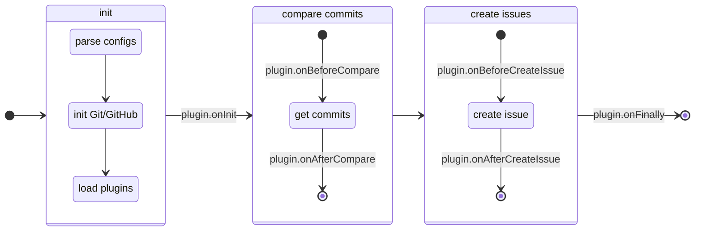

# Contributing to Yuki-no

Thank you for your interest in contributing to Yuki-no! This guide will help you get started.

## Development Setup

### Prerequisites

- Node.js v22.12.0+
- [pnpm](https://pnpm.io/) (install via [Node Corepack](https://nodejs.org/api/corepack.html))
  ```bash
  corepack enable
  ```
- GitHub account
- An upstream repository
- GitHub Personal Access Token (Fine-grained)

### Setting up GitHub Fine-grained PAT

> [!WARNING]
>
> **Important Notes**
>
> - Never share your PAT with anyone
> - Use Fine-grained PAT instead of Classic PAT for better permission control

1. [Create a new Fine-grained PAT](https://github.com/settings/personal-access-tokens/new)
2. Repository access settings:
   - Select "Only select repositories"
   - Choose your upstream repository
3. Repository Permissions:
   - Contents: Read and write
   - Issues: Read and write (needed for release tracking)
   - Metadata: Read (set automatically)

For more details, see [GitHub documentation](https://docs.github.com/en/authentication/keeping-your-account-and-data-secure/managing-your-personal-access-tokens).

### Local Environment Setup

> [!WARNING]
>
> **Important Notes**
>
> - The `.env` file is in .gitignore by default
> - Never commit the `.env` file to git

1. [Fork](https://github.com/Gumball12/yuki-no/fork) and clone the repository

   ```bash
   git clone https://github.com/Gumball12/yuki-no.git
   cd yuki-no

   # Enable Corepack
   # https://nodejs.org/api/corepack.html
   corepack enable

   # Install dependencies
   pnpm install
   ```

2. Create `.env` file in the [core package](./packages/core/)

   ```.env
   # /packages/core/.env

   ACCESS_TOKEN=your_pat_here
   USER_NAME=your_github_username
   EMAIL=your_github_email
   HEAD_REPO=https://github.com/head_username/head_repo.git
   UPSTREAM_REPO=https://github.com/your_username/your_repo.git
   TRACK_FROM=head_commit_hash

   # ...
   ```

   Note that **you must set `UPSTREAM_REPO` when developing locally**. The automatic repository detection only works in GitHub Actions.

For more environment variables, see [README](./README.md#configuration).

### Development Workflow

1. Create a new branch for your changes:
   ```bash
   git checkout -b feat/your-feature
   ```
2. Run tests:
   ```bash
   pnpm test # unit tests
   ```
3. Run Yuki-no locally:
   ```bash
   # If you are using plugins locally, you must install those
   # plugins as devDependencies. Otherwise, you will encounter
   # a "Failed to load plugin" error.
   pnpm start:dev # run yuki-no with packages/core/.env
   ```
4. Format your code:
   ```bash
   pnpm lint
   ```
5. Commit your changes following [Conventional Commits](https://www.conventionalcommits.org/):
   ```bash
   git commit -m "feat: add new feature"
   git commit -m "fix: resolve issue #123"
   ```
6. Push your changes and create a pull request!

### Troubleshooting

#### Common Issues

If you find bugs not covered here, please [open an issue](https://github.com/Gumball12/yuki-no/issues).

**GitHub API 403 Errors:**

- Check your PAT permissions

## Project Structure

```
packages/
├── core/                   # Main core logic (@yuki-no/plugin-sdk)
│   ├── infra/              # Infrastructure layer (git, github)
│   ├── plugin/             # Plugin SDK for external plugins
│   ├── types/
│   ├── utils/              # Common utilities
│   └── utils-infra/        # Infrastructure utilities
├── release-tracking/       # Core release tracking plugin
└── other packages...
```

#### Available Packages

For detailed information about each package, see their individual documentation:

- **[Core Package](./packages/core/README.md)** (`@yuki-no/plugin-sdk`) - Yuki-no Plugin SDK
- **[Release Tracking Plugin](./packages/release-tracking/README.md)** (`@yuki-no/plugin-release-tracking`)

### Flow

The diagram below shows the execution flow of Yuki-no:



1. **Initialize:** Parses configuration, initializes Git/GitHub clients, and loads configured plugins
1. **Compare Commits:** Compares commits from `head-repo` with plugin lifecycle hooks (`onBeforeCompare`/`onAfterCompare`)
1. **Create Issues:** Creates GitHub issues to `upstream-repo` for each new commit with plugin lifecycle hooks (`onBeforeCreateIssue`/`onAfterCreateIssue`)

## Testing

The project uses [Vitest](https://vitest.dev/) for testing.

### Running Tests

To run tests with coverage:

```bash
pnpm test
```

### About Mocking

We generally recommend avoiding excessive mocking in tests. However, for operations with side-effects that aren't directly related to what you're testing, mocking is appropriate:

- Network requests to external services (e.g. GitHub API)
- File system operations (creating/deleting files, like Git)
- Other operations with unpredictable results

External libraries without side-effects should **not** be mocked. These libraries are typically well-tested already, and as long as their version remains consistent, they won't introduce unexpected behavior.

For similar reasons, most mocked behaviors are excluded from our test coverage metrics. Currently, we only have [mockedRequests.test.ts](./packages/core/tests/mockedRequests.test.ts) for testing GitHub API interactions while maintaining idempotence.

When mocking is necessary, follow these practices:

- Mock only the specific functions needed
- Keep mocks as close to real behavior as possible
- Reset mocks between tests using `vi.clearAllMocks()`

## Getting Help

If you need help:

1. Check existing issues and docs
2. Open a new issue with a clear description

## For Maintainers

### Claude Code Reviews: On-Demand Only

We use **mention-based Claude reviews** for flexible, selective code feedback.

**How to use:**

```
@claude Please review this code focusing on [specific concerns]
```

**Status:**

- ✅ **Interactive Review** ([claude.yml](./.github/workflows/claude.yml)) - Active
- ❌ **Automated Review** ([claude-code-review.yml](./.github/workflows/claude-code-review.yml)) - Temporarily disabled

**Why selective approach?** Avoids unnecessary automation while maintaining code quality when needed.

For detailed configuration and principles, see [Claude GitHub Actions documentation](https://docs.anthropic.com/en/docs/claude-code/github-actions).

### Publishing

This monorepo contains multiple npm packages that can be published independently to npm using automated GitHub workflows.

1. **Create GitHub Release** with tag format: `<package-name>-v<version>`
   - e.g. Core package: `core-v1.4.2` / Release tracking package: `release-tracking-v1.0.1`
2. **GitHub Actions automatically ([publish.yml](./.github/workflows/publish.yml)):**
   - Extracts package name and version from the release tag
   - Updates the package.json version in the corresponding package
   - Commits the version change
   - Runs tests and linting
   - Publishes to npm with provenance

## License

By contributing, you agree that your contributions will be licensed under the MIT License. See [LICENSE](LICENSE) for details.
