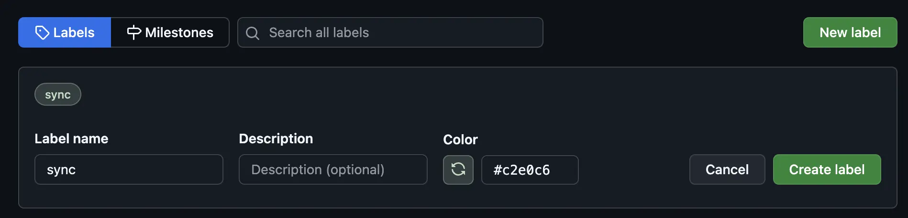
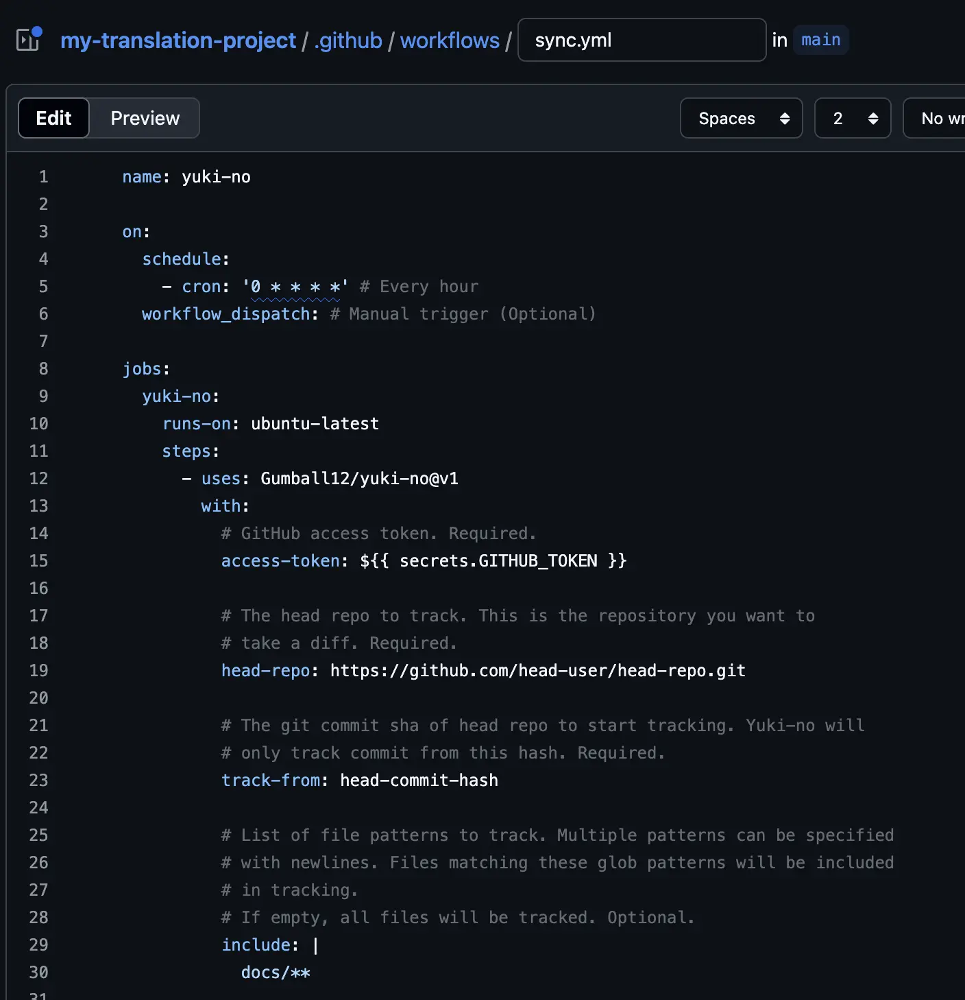

# Migrate to Yuki-no

This guide shows how to use Yuki-no in projects that use GitHub Issues for translation, such as those using [Ryu-Cho](https://github.com/vuejs-translations/ryu-cho).

## Migration Process

### Eligible Projects

- Projects that use GitHub Issues for translation, like Ryu-Cho
  - Track Head Repo changes through GitHub Issues
  - Each issue body contains links to a specific commit in the Head Repo
  - Head Repo must be a Public GitHub repository
- GitHub Issues must contain GitHub Commit URLs for original commits
  - GitHub Commit URL format: `https://github.com/<org_name>/<repo_name>/commit/<commit_hash>`
  - Examples:
    ```
    New updates on head repo.
    https://github.com/test/test/commit/1234567
    ```
    ```md
    Previous translation process: [See Commit](https://github.com/test/test/commit/1234567)
    ```

### Migration Steps

> [!WARNING]
>
> For a successful migration, set `track-from` to the last commit hash that was fully translated. Using an incorrect value when first running Yuki-no may create duplicate issues for already translated content. Note that Yuki-no starts tracking from the commit after your specified `track-from` hash, not including the `track-from` commit itself.

1. Add Labels to Translation Issues for Yuki-no Tracking

   
   - Yuki-no identifies which issues it manages through labels
   - Go to GitHub and create labels like `sync`
   - Add these labels to your existing translation issues
   - Note: Adding these labels to non-translation issues may cause problems

2. Create Yuki-no Action Configuration File

   
   - Remove any existing sync action files (like Ryu-Cho)
   - Create a new Yuki-no config file by following the [Usage](https://github.com/Gumball12/yuki-no?tab=readme-ov-file#usage) section
   - If moving from Ryu-Cho, check the [Yuki-no Options vs Ryu-Cho Options](#yuki-no-options-vs-ryu-cho-options) section below

3. Run the Action
   - Wait for the next scheduled run, or trigger it manually if you enabled `on.workflow_dispatch` (see [GitHub docs](https://docs.github.com/en/actions/managing-workflow-runs-and-deployments/managing-workflow-runs/manually-running-a-workflow))
   - The first run may take some time as it processes all commits after the `track-from` hash
   - Check your translation issues after it finishes

#### Yuki-no Options vs Ryu-Cho Options

For detailed option descriptions, see [README](./README.md#configuration).

**Options No Longer Required:**

- `username`: Not needed - uses GitHub Actions bot by default
- `email`: Not needed - uses GitHub Actions bot by default
- `upstream-repo`: Automatically detected in GitHub Actions

**Removed Options:**

- `upstream-repo-branch`: Upstream Repo always uses the default branch
- `workflow-name`: Not used in Yuki-no

**Options Kept the Same:**

- `head-repo`: URL of the original repository
- `head-repo-branch`: Branch of the original repository (default: `main`)
- `track-from`: Starting commit hash for tracking

**Changed Options:**

- `path-starts-with`: Use the new `include` option with [Glob patterns](https://github.com/micromatch/picomatch?tab=readme-ov-file#advanced-globbing) instead (e.g., `docs/` becomes `docs/**`)

**New Options:**

- `include`, `exclude`: Filter files to track using Glob patterns
- `labels`: Labels to add to issues (default: `sync`)
- `release-tracking`, `release-tracking-labels`: Track release status (`release-tracking-labels` default: `pending`)
- `verbose`: Show detailed logs (default: `true`)

#### Important Notes

**If issues or comments aren't being created:**


- Go to Settings > Actions > General > Workflow permissions
- Select "Read and write permissions"
- Save the changes
