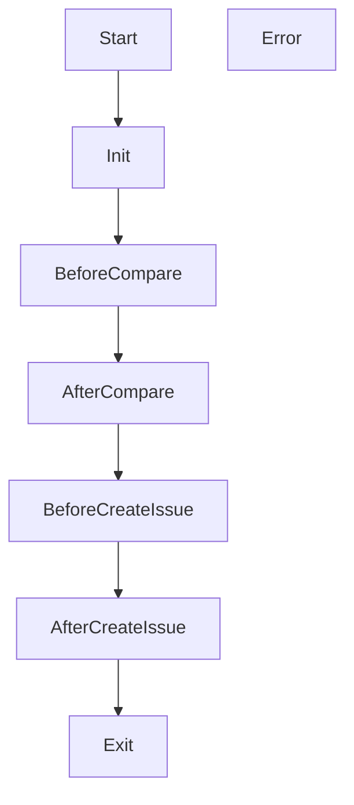

# Developing Yuki-no Plugins

Yuki-no supports external plugins that can hook into its lifecycle. Specify plugin package names with the `plugins` option in your workflow. Names are conventionally prefixed with `yuki-no-plugin-`, though this is not enforced. Ensure plugins are installed in the action environment (e.g. `pnpm add yuki-no-plugin-foo`).

> [!INFO]
> Every plugin **must** export a default object implementing any of the lifecycle hooks below.

## Lifecycle Hooks



### `function onInit(ctx: YukiNoContext): Promise<void> | void`
Called when the action starts.

### `function onBeforeCompare(ctx: YukiNoContext): Promise<void> | void`
Runs before commit comparison.

### `function onAfterCompare(ctx: YukiNoContext & { commits: Commit[] }): Promise<void> | void`
Called after comparing commits with the list of new commits.

### `function onBeforeCreateIssue(ctx: YukiNoContext & { commit: Commit; meta: IssueMeta }): Promise<void> | void`
Invoked before each issue is created. Plugins may mutate `meta` to customize the issue.

### `function onAfterCreateIssue(ctx: YukiNoContext & { commit: Commit; result: IssueResult }): Promise<void> | void`
Runs after each issue is created.

### `function onExit(ctx: YukiNoContext & { success: boolean }): Promise<void> | void`
Called before the action exits.

### `function onError(ctx: YukiNoContext & { error: Error }): Promise<void> | void`
Called whenever an error occurs.

### `YukiNoContext`
```ts
{
  octokit: Octokit;
  context: Context;
  inputs: { [k: string]: string; };
}
```

## Example Plugin

See [`src/plugins/example`](./src/plugins/example) for a minimal plugin template.

## Publishing

1. Create a package named `yuki-no-plugin-<name>`.
2. Export the plugin as `default` from your entry file.
3. Publish the package to npm and install it in your repository.
4. Add the package name to the `plugins` option of Yuki-no.
