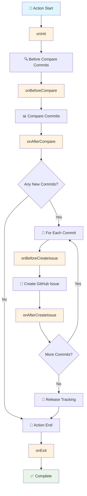

# Yuki-no Plugin System

Yuki-no supports external plugins that can hook into its lifecycle. Specify plugin package names with the `plugins` option in your workflow. Names are conventionally prefixed with `yuki-no-plugin-`, though this is not enforced.

## Plugin Lifecycle

Yuki-no executes plugins through a well-defined lifecycle that corresponds to the main phases of repository synchronization and issue creation.

### Lifecycle Flow



### Hook Reference

#### `onInit(ctx: YukiNoContext)`

Called when the action starts, after configuration is loaded.

#### `onBeforeCompare(ctx: YukiNoContext)`

Called before comparing commits between repositories.

#### `onAfterCompare(ctx: YukiNoContext & { commits: Commit[] })`

Called after commit comparison, with the list of new commits.

#### `onBeforeCreateIssue(ctx: YukiNoContext & { commit: Commit; meta: IssueMeta })`

Called before each issue is created. The `meta` object is read-only for inspection purposes.

#### `onAfterCreateIssue(ctx: YukiNoContext & { commit: Commit; result: IssueResult })`

Called after each issue is created.

#### `onExit(ctx: YukiNoContext & { success: boolean })`

Called before the action exits (success or failure).

#### `onError(ctx: YukiNoContext & { error: Error })`

Called when any error occurs during execution.

### Context Types

```ts
type YukiNoContext = {
  octokit: Octokit; // GitHub API client (@octokit/rest)
  context: Context; // GitHub Actions context (@actions/github/lib/context)
  inputs: Record<string, string>; // Action input parameters
};

type IssueMeta = {
  title: string; // Issue title (read-only)
  body: string; // Issue body (read-only)
  labels: string[]; // Issue labels (read-only)
};
```

## Plugin Development

### Installing Types

Install yuki-no as a dependency to get TypeScript types:

```bash
npm install @gumball12/yuki-no
# or
yarn add @gumball12/yuki-no
# or PNPM, ...
```

### Creating a Plugin

> [!NOTE]
> Every plugin **must** export a default object implementing any of the lifecycle hooks below.

Create a plugin by implementing the `YukiNoPlugin` interface:

```ts
import type { YukiNoPlugin } from 'yuki-no';

const myPlugin: YukiNoPlugin = {
  name: 'my-plugin',

  async onInit(ctx) {
    console.log('Plugin initialized!');
    // Initialize plugin state, validate configuration
  },

  async onBeforeCompare(ctx) {
    // Called before comparing commits
    console.log('About to compare commits...');
  },

  async onAfterCompare(ctx) {
    // Called after comparing commits
    console.log(`Found ${ctx.commits.length} new commits`);
  },

  async onBeforeCreateIssue(ctx) {
    // Inspect issue metadata before creation
    console.log(`Creating issue: ${ctx.meta.title}`);
    console.log(`Labels: ${ctx.meta.labels.join(', ')}`);
  },

  async onAfterCreateIssue(ctx) {
    // Called after issue is created
    console.log(`Created issue #${ctx.result.number}: ${ctx.result.html_url}`);
  },

  async onExit(ctx) {
    console.log(`Plugin finished, success: ${ctx.success}`);
    // Cleanup, send notifications
  },

  async onError(ctx) {
    console.error('Plugin error:', ctx.error.message);
    // Error handling, send alerts
  },
};

export default myPlugin;
```

### Example Plugin

See [`src/plugins/example`](./src/plugins/example) for a minimal plugin template that demonstrates the basic structure.

### Using Plugins

You can use plugins in two ways:

#### 1. npm Package (Recommended)

Install a published npm package:

```yaml
- uses: Gumball12/yuki-no@v1
  with:
    # ... other options ...

    # [Optional]
    # List of plugin package names to load
    plugins: |
      yuki-no-plugin-slack
      @my-org/yuki-no-plugin-teams
```

#### 2. Local File Path

Use a local plugin file. The path is relative to your **repository root**:

```yaml
# .github/workflows/sync.yml
- uses: Gumball12/yuki-no@v1
  with:
    # ... other options ...

    # [Optional]
    # List of plugin package names to load
    plugins: |
      ./plugins/my-custom-plugin.js
      ./scripts/yuki-plugins/slack-notifier.js
      ./.github/plugins/custom-labeler.js
```

### Publishing

1. **Create Package**: Create a package named like `yuki-no-plugin-<name>`
2. **Export Plugin**: Export the plugin as `default` from your entry file
3. **Publish**: Publish the package to npm
4. **Install**: Install it in your repository where you use Yuki-no
5. **Configure**: Add the package name to the `plugins` option in your workflow

Example package structure:

```
yuki-no-plugin-example/
├── package.json
├── index.js (or index.ts)
└── README.md
```

Your `index.js` should export the plugin as default:

```javascript
export default {
  name: 'example-plugin',
  async onInit(ctx) {
    // Plugin implementation
  },
};
```
