# Yuki-no Plugin System

Yuki-no supports external plugins that can hook into its lifecycle. Specify plugin package names with the `plugins` option in your workflow. Names are conventionally prefixed with `yuki-no-plugin-`, though this is not enforced.

## Plugin Lifecycle

Yuki-no executes plugins through a well-defined lifecycle that corresponds to the main phases of repository synchronization and issue creation.

### Lifecycle Flow

```mermaid
graph TD
    A[🚀 Action Start] --> B[onInit]
    B --> C[🔍 Before Compare Commits]
    C --> D[onBeforeCompare]
    D --> E[📊 Compare Commits]
    E --> F[onAfterCompare]
    F --> G{Any New Commits?}

    G -->|Yes| H[📝 For Each Commit]
    G -->|No| P[🏁 Action End]

    H --> I[onBeforeCreateIssue]
    I --> J[🎫 Create GitHub Issue]
    J --> K[onAfterCreateIssue]
    K --> L{More Commits?}

    L -->|Yes| H
    L -->|No| M[🔄 Release Tracking]
    M --> P

    P --> N[onExit]
    N --> O[✅ Complete]


    style A fill:#e1f5fe
    style O fill:#e8f5e8
    style B fill:#fff3e0
    style D fill:#fff3e0
    style F fill:#fff3e0
    style I fill:#fff3e0
    style K fill:#fff3e0
    style N fill:#fff3e0
```



## Plugin Development

### Installing Dependencies

[](https://www.npmjs.com/package/@gumball12/yuki-no)

Install [yuki-no](https://www.npmjs.com/package/@gumball12/yuki-no) as a dependency to get TypeScript types, input helpers, and testing utilities:

```bash
npm install @gumball12/yuki-no
```

### Creating a Plugin

> [!NOTE]
> Every plugin **must** export a default object implementing any of the lifecycle hooks below.

Create a plugin by implementing the `YukiNoPlugin` interface:

```ts
import type { YukiNoPlugin } from 'yuki-no';

const myPlugin: YukiNoPlugin = {
  name: 'my-plugin',

  async onInit(ctx) {
    console.log('Plugin initialized!');
    // Initialize plugin state, validate configuration
  },

  async onBeforeCompare(ctx) {
    // Called before comparing commits
    console.log('About to compare commits...');
  },

  async onAfterCompare(ctx) {
    // Called after comparing commits
    console.log(`Found ${ctx.commits.length} new commits`);
  },

  async onBeforeCreateIssue(ctx) {
    // Inspect issue metadata before creation
    console.log(`Creating issue: ${ctx.meta.title}`);
    console.log(`Labels: ${ctx.meta.labels.join(', ')}`);
  },

  async onAfterCreateIssue(ctx) {
    // Called after issue is created
    console.log(`Created issue #${ctx.result.number}: ${ctx.result.html_url}`);
  },

  async onExit(ctx) {
    console.log(`Plugin finished, success: ${ctx.success}`);
    // Cleanup, send notifications
  },

  async onError(ctx) {
    console.error('Plugin error:', ctx.error.message);
    // Error handling, send alerts
  },
};

export default myPlugin;
```

- `onInit(ctx: YukiNoContext)`: Called when the action starts, after configuration is loaded.
- `onBeforeCompare(ctx: YukiNoContext)`: Called before comparing commits between repositories.
- `onAfterCompare(ctx: YukiNoContext & { commits: Commit[] })`: Called after commit comparison, with the list of new commits.
- `onBeforeCreateIssue(ctx: YukiNoContext & { commit: Commit; meta: IssueMeta })`: Called before each issue is created. The `meta` object is read-only for inspection purposes.
- `onAfterCreateIssue(ctx: YukiNoContext & { commit: Commit; result: IssueResult })`: Called after each issue is created.
- `onExit(ctx: YukiNoContext & { success: boolean })`: Called before the action exits (success or failure).
- `onError(ctx: YukiNoContext & { error: Error })`: Called when any error occurs during execution.

See [@gumball12/yuki-no-plugin-test](https://github.com/Gumball12/yuki-no-plugin-test) for a plugin example.

### Passing Inputs to Plugins

Plugins can receive custom values using environment variables instead [`with`](https://docs.github.com/en/actions/reference/workflow-syntax-for-github-actions#jobsjob_idstepswith). This approach avoids IDE warnings about undefined inputs and follows GitHub Actions best practices. Use the `env` block to pass custom values to your plugins:

```yaml
- uses: Gumball12/yuki-no@v1
  env:
    PLUGIN_CUSTOM_MESSAGE: ${{ secrets.CUSTOM_MESSAGE }}
    PLUGIN_IS_TRUE: true
    PLUGIN_MY_VALUES: |
      value 1
      value 2
  with:
    # ... standard yuki-no inputs only ...
    access-token: ${{ secrets.GITHUB_TOKEN }}
    head-repo: https://github.com/vitejs/vite.git
    track-from: abc123
```

```ts
import { getBooleanInput, getInput, getMultilineInput } from 'yuki-no';

const customMessage = getInput('PLUGIN_CUSTOM_MESSAGE');
const isTrue = getBooleanInput('PLUGIN_IS_TRUE');
const myValues = getMultilineInput('PLUGIN_MY_VALUES');
```

> [!TIP]
> We recommend prefixing your environment variables with `PLUGIN_` to avoid conflicts with system variables.

### Context Types

```ts
type YukiNoContext = {
  octokit: Octokit; // GitHub API client (@octokit/rest)
  context: Context; // GitHub Actions context (@actions/github/lib/context)
};

type IssueMeta = {
  title: string; // Issue title
  body: string; // Issue body
  labels: string[]; // Issue labels
};
```

### Publishing

1. **Create Package**: Create a package named like `yuki-no-plugin-<name>`
2. **Export Plugin**: Export the plugin as `default` from your entry file
3. **Publish**: Publish the package to npm
4. **Install**: Users can install it in their repositories or reference it directly in workflows
5. **Configure**: Add the package name to the `plugins` option in your workflow

### Testing Plugins Locally

Use the built-in helpers to test your plugins without running the full action. These helpers are exported from the main package.

```ts
import { createTestContext, loadPluginForTesting, runHook } from 'yuki-no';
```

1. **createTestContext** – Builds a `YukiNoContext` object with optional inputs or mocked dependencies.
2. **loadPluginForTesting** – Loads a plugin from a file path or package name.
3. **runHook** – Executes a specific lifecycle hook of a plugin.

#### Testing Example

```ts
import { describe, expect, it } from 'vitest';
import { createTestContext, loadPluginForTesting, runHook } from 'yuki-no';

describe('my plugin', () => {
  it('calls onInit', async () => {
    const plugin = await loadPluginForTesting('@gumball12/yuki-no-plugin-test');
    const ctx = createTestContext({ PLUGIN_MESSAGE: 'test message' });
    await runHook(plugin, 'onInit', ctx);
    // add your expectations
  });
});
```

Run your tests with your preferred test runner, like `vitest`.

## Using Plugins

You can use plugins in two ways:

### 1. npm Package (Recommended)

Install a published npm package:

```yaml
- uses: Gumball12/yuki-no@v1
  with:
    # ... other options ...

    # [Optional]
    # List of plugin package names to load
    plugins: |
      yuki-no-plugin-slack
      @my-org/yuki-no-plugin-teams
```

### 2. Local File Path

Use a local plugin file. The path is relative to your **repository root**:

```yaml
# .github/workflows/sync.yml
- uses: Gumball12/yuki-no@v1
  with:
    # ... other options ...

    # [Optional]
    # List of plugin package names to load
    plugins: |
      ./plugins/my-custom-plugin.js
      ./scripts/yuki-plugins/slack-notifier.js
      ./.github/plugins/custom-labeler.js
```
