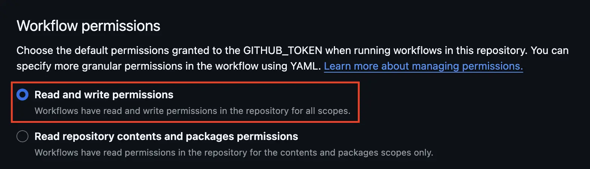

# Yuki-no

[](https://github.com/Gumball12/yuki-no/actions/workflows/ci.yml) [](https://codecov.io/gh/Gumball12/yuki-no)


Yuki-no (雪の, means "of snow" in Japanese) is a GitHub Action that creates issues from the head repo based on its commits. This is particularly useful for tracking changes between repositories, especially in documentation translation projects.

> **Why Yuki-no?** Looking for a reliable, automated solution for managing documentation translation? Check out [why Yuki-no](./WHY.md) might be the right choice for your project.

## Features

- Automatically tracks commits from a head repository
- Creates issues for new changes
- Filters changes based on file paths (`include` and `exclude` options)
- Supports custom labels for issues (`label` option)
- Tracks release status with pre-release and release information (`release-tracking` option)
- Manages release tracking labels for unreleased changes (`release-tracking-labels` option)

Yuki-no is actively used in the [Vite Korean docs translation project](https://github.com/vitejs/docs-ko), [Korean translation for Vue docs](https://github.com/vuejs-translations/docs-ko) demonstrating its effectiveness in real-world translation workflows.

## Usage

1. **Required**: Configure workflow permissions

   

   - Go to Settings > Actions > General > Workflow permissions
   - Select "Read and write permissions"
   - Save the changes

   This is a standard requirement for any GitHub Actions that need to create issues or make repository changes. Without these permissions, the action will fail with a `403 "Resource not accessible by integration"` error when trying to create issues or manage labels.

2. Create `.github/workflows/yuki-no.yml`:

   ```yml
   name: yuki-no

   on:
     schedule:
       - cron: '0 * * * *' # Every hour
     workflow_dispatch: # Manual trigger (Optional)

   jobs:
     yuki-no:
       runs-on: ubuntu-latest
       steps:
         - uses: Gumball12/yuki-no@v1
           with:
             # GitHub access token. Required.
             access-token: ${{ secrets.GITHUB_TOKEN }}

             # The head repo to track. This is the repository you want to
             # take a diff. Required.
             head-repo: https://github.com/head-user/head-repo.git

             # The git commit sha of head repo to start tracking. Yuki-no will
             # only track commit from this hash. Required.
             track-from: head-commit-hash

             # List of file patterns to track. Multiple patterns can be specified
             # with newlines. Files matching these Glob patterns will be included
             # in tracking.
             # Glob Pattern: https://github.com/micromatch/picomatch?tab=readme-ov-file#advanced-globbing
             # If empty, all files will be tracked. Optional.
             include: |
               docs/**

             # Whether to enable release tracking.
             # When enabled, Yuki-no will track releases for each issue
             # and add comments about release status. Optional.
             # Defaults to 'false'
             release-tracking: true
   ```

   Once configured, Yuki-no will create issues in your repository for any new changes in the `head-repo`. On its first run, it will process all commits after the specified `track-from` hash with your `include` and `exclude` filters. If you've enabled `workflow_dispatch`, you can also [trigger the action manually](https://docs.github.com/en/actions/managing-workflow-runs-and-deployments/managing-workflow-runs/manually-running-a-workflow) to process changes immediately.

### Configuration

| Option                    | Required | Default             | Description                                       |
| ------------------------- | -------- | ------------------- | ------------------------------------------------- |
| `access-token`            | Yes      | -                   | GitHub access token                               |
| `head-repo`               | Yes      | -                   | URL of repository to track                        |
| `track-from`              | Yes      | -                   | Starting commit hash                              |
| `include`                 | No       | -                   | Glob patterns for files to track                  |
| `exclude`                 | No       | -                   | Glob patterns for files to exclude                |
| `labels`                  | No       | `sync`              | Labels for issues (newline separated)             |
| `release-tracking`        | No       | `false`             | Enable release status tracking                    |
| `release-tracking-labels` | No       | `pending`           | Labels for unreleased changes (newline separated) |
| `verbose`                 | No       | `true`              | Enable verbose logging                            |
| `username`                | No       | `github-actions`    | Git username for commits                          |
| `email`                   | No       | `action@github.com` | Git email for commits                             |
| `upstream-repo`           | No       | Current repository  | URL of your repository                            |
| `head-repo-branch`        | No       | `main`              | Branch to track in head repo                      |

For more detailed option descriptions, please refer to the [config.ts](./src/config.ts).

#### File Pattern Examples

```yaml
# Track only markdown and TypeScript files
include: |
  **/*.md
  **/*.ts

# Exclude test files
exclude: |
  **/*.test.ts
  **/__tests__/**
```

### How It Works

1. Monitors the head repository for new commits
2. When new commits are found:
   - Checks if the commit is newer than the last successful workflow run
   - Processes commits in optimized batches of 5 to minimize API usage
   - Implements strategic delays between operations to respect API rate limits
   - Creates issues for new changes with specified labels
   - Tracks release status if enabled
3. For release tracking:
   - Monitors pre-release and release tags
   - Updates issue comments with status changes
   - Manages release tracking labels for unreleased changes
   - Stops tracking when final release is available

### Caveats

For important notes about initial setup, rate limits, error recovery, and other considerations, please refer to our [Caveats](./CAVEATS.md).

## Contributing

See [CONTRIBUTING.md](CONTRIBUTING.md) for development setup and contribution guidelines.

## License

MIT License. See [LICENSE](LICENSE) for details.
