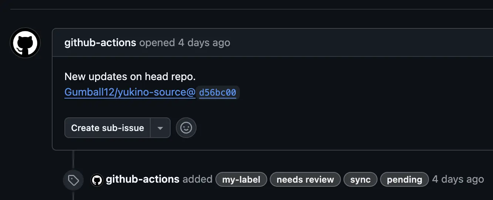
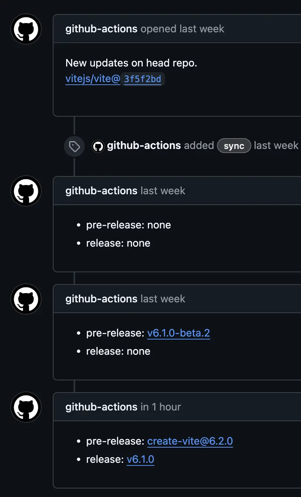

# Why Yuki-no

Technical docs translation plays a vital role in helping more people utilize technology and growing the open-source community. For various reasons including cost, scalability, flexibility, and data ownership, translation projects often build their own translation processes based on open-source rather than using commercial SaaS solutions, and there are various open-source solutions supporting this.

Among them, [Ryu-Cho](https://github.com/vuejs-translations/ryu-cho) (a fork of [Che-Tsumi](https://github.com/vuejs-jp/che-tsumi) project) is a well-established open-source translation management solution based on GitHub Actions created by [Vue.js Translations](https://github.com/vuejs-translations). It provides synchronization functionality that monitors specific repos and creates GitHub Issues when commits occur, and has been successfully used in various Vite/Vue.js ecosystem projects.

Yuki-no (雪の, meaning "of snow" in Japanese) builds upon these foundations while introducing additional features and enhancements specifically designed for modern translation workflows. Through this evolution, Yuki-no aims to provide a comprehensive solution for building robust and efficient open-source translation processes.

## The Problems

I am participating as a maintainer in the [Vite Korean docs translation project](https://github.com/vitejs/docs-ko). This project previously used Ryu-Cho but has now switched to Yuki-no.

Below are what I consider to be the _three essential features for technical docs translation projects_.

### Change Tracking

Automatic tracking of commits from the original docs is crucial. This is particularly important when docs are frequently updated or contain a large amount of content, where manual tracking becomes impractical.

Change tracking directly affects the reliability of translated docs, making it more crucial than other features. Missing commits can lead to outdated translations or unnecessary work on content that may change again.

_Example: Yuki-no automatically creates an issue for new commits in the head repository_

Building on existing solutions, Yuki-no implements enhanced change tracking with several reliability improvements:

- Maintains accurate tracking even when Actions fail by using successful run timestamps
- Implements intelligent retry mechanisms for API failures
- Provides detailed logging for better visibility and debugging
- Uses batch processing to handle large numbers of commits efficiently

These enhancements ensure that no commits are missed, even in edge cases like Action failures or API rate limits. By tracking only successful Action runs as checkpoints, Yuki-no prevents commits from being lost during temporary failures and automatically resumes from the last successful point. This makes it particularly reliable for projects with frequent documentation updates.

### Release Status Tracking

Release status tracking is a critical aspect of documentation translation. Users generally expect documentation to align with released versions, making it important to distinguish between released and unreleased content during the translation process.

While existing tools focus on change detection, Yuki-no introduces comprehensive release tracking capabilities. This feature helps translation teams make informed decisions about which content to prioritize, ensuring that documentation remains in sync with official releases.

_Example: Yuki-no tracks release status and updates issue comments accordingly_

Through the `release-tracking` and `release-tracking-labels` options, Yuki-no provides automated release status tracking using Issue Comments and Issue Labels. This systematic approach helps teams:

- Prioritize translation work based on release status
- Avoid premature translation of unreleased features
- Maintain clear visibility of content readiness
- Streamline the translation workflow

### Work Status Tracking

Effective coordination is essential in translation projects, whether working individually or as a team. Clear tracking of work assignments helps prevent duplication of effort and ensures consistent translation quality.

Yuki-no enhances the GitHub Issues-based workflow with additional organizational features. The `labels` option enables teams to:

- Easily filter and manage translation tasks
- Maintain clear separation between translation and general issues

These enhancements help create a more organized and efficient translation workflow while leveraging GitHub's familiar interface.

### Yuki-no

Yuki-no fulfills the "three essential features for technical docs translation projects" and provides various other features and improvements. These include using GitHub Actions Bot by default, easier and clearer Actions config, `include` and `exclude` options for specifying change tracking targets based on [Glob patterns](https://github.com/micromatch/picomatch?tab=readme-ov-file#advanced-globbing), and a `verbose` option for more detailed logging.

If you're planning to start a translation project or considering implementing Yuki-no in an existing translation project, [check out this guide](README.md). There's also a [migration guide](./MIGRATION.md) for users of issue-based translation processes like Ryu-Cho. For real-world usage examples, you can refer to the [vite/docs-ko repo](https://github.com/vitejs/docs-ko/blob/main/.github/workflows/sync.yml).

## Other Open-Source Solutions

Most open-source solutions were deemed unsuitable for docs translation projects because they either focus on application localization ([Tolgee](https://github.com/tolgee/tolgee-platform)), are not open-source ([Crowdin](https://crowdin.com/)), or have complexity issues ([GitLocalize](https://gitlocalize.com/)).

### Weblate

[Weblate](https://github.com/WeblateOrg/weblate) is a powerful open-source translation solution that provides various features along with real-time collaboration. It offers integration with Git-based platforms like GitHub and GitLab and is continuously developed with an active community.

However, it requires self-hosting and has complex setup and maintenance requirements. While it provides a web-based translation platform, this unfamiliarity might actually become a barrier to entry. Additionally, with its many features, it might not be suitable for projects seeking a streamlined translation process.

### Docusaurus

[Docusaurus](https://github.com/facebook/docusaurus) is a static website generator developed by Meta (formerly Facebook) with built-in i18n capabilities. From a translation process perspective, it has the following characteristics:

**Advantages:**

- Provides basic structure and tools for translation
- Quick and easy multilingual site setup
- Automatic translation file generation
- Translation progress tracking

**Disadvantages:**

- Manual translation synchronization process
- Difficult to track changes in original documentation
- Lack of release status tracking
- Not optimized for GitHub Issues-based collaboration

While Docusaurus is an excellent tool for building documentation sites, it has limitations in terms of translation process automation. Yuki-no complements these limitations by enabling efficient GitHub-based translation processes.
