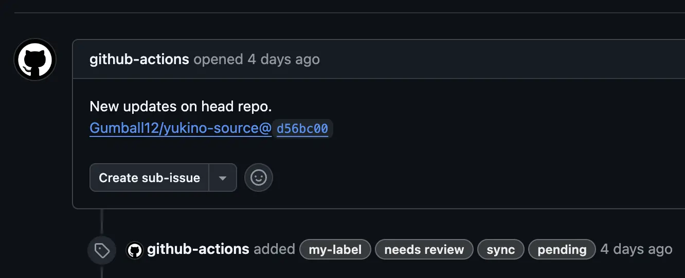
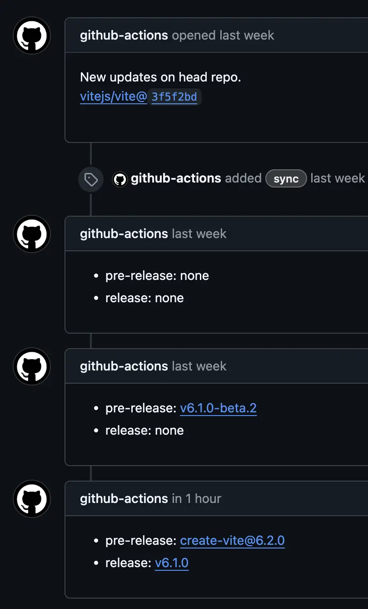

# Why Yuki-no

Technical docs translation helps more people use technology and grows the open-source community. Many translation projects build their own processes using open-source tools instead of commercial solutions. This choice offers better cost control, scalability, flexibility, and data ownership.

[Ryu-Cho](https://github.com/vuejs-translations/ryu-cho) (a fork of [Che-Tsumi](https://github.com/vuejs-jp/che-tsumi)) is a popular open-source translation management tool created by [Vue.js Translations](https://github.com/vuejs-translations). It uses GitHub Actions to monitor specific repositories and creates GitHub Issues when new commits appear. Many Vite/Vue.js ecosystem projects use it successfully.

Yuki-no (雪の, "of snow" in Japanese) builds on these foundations. It adds new features designed specifically for modern translation workflows. The goal is to provide a complete solution for efficient open-source translation processes.

## The Problems

I maintain the [Vite Korean docs translation project](https://github.com/vitejs/docs-ko). We previously used Ryu-Cho but have switched to Yuki-no.

Here are what I consider the _three essential features for technical docs translation projects_.

### 1. Change Tracking

Automatically tracking commits from the original docs is crucial. This becomes especially important when:

- Documentation updates happen frequently
- The content is extensive
- Manual tracking is impractical

Change tracking directly affects translation reliability. It's more important than most other features. Missing commits can lead to:

- Outdated translations
- Unnecessary work on content that might change again soon

_Example: Yuki-no automatically creates an issue for new commits in the head repository_

Yuki-no improves on existing solutions with several reliability enhancements:

- Keeps tracking accurate even when Actions fail by using successful run timestamps
- Uses retry systems for GitHub API failures
- Provides detailed logs for better troubleshooting

These improvements ensure no commits are missed, even in challenging situations like Action failures or API rate limits. By tracking only successful Action runs as checkpoints, Yuki-no prevents losing commits during temporary failures. It automatically resumes from the last successful point. This makes it especially reliable for projects with frequent documentation updates.

### 2. Extensible Plugin System

Translation projects require vastly different workflows depending on team size, project scope, content type, and organizational structure. This diversity significantly impacts the choice of translation management tools:

- **Release Tracking**: Some projects need detailed beta/stable release status management
- **Notification Systems**: Teams prefer different communication channels (Slack, Discord, email, webhooks)
- **Quality Management**: Varying needs for automated terminology checks, reviewer assignment, etc.
- **External Integrations**: Existing project management tools, CI/CD pipelines, and custom systems

Most existing translation management tools provide only fixed workflows. When new requirements emerge or team processes change, teams must either switch tools or use complex workarounds. Custom integrations with external systems or team-specific features are particularly difficult to implement.

_Example: The `release-tracking` plugin automatically manages release status_

Yuki-no addresses these diverse requirements through an extensible [plugin architecture](./PLUGINS.md):

- **Custom Workflow Integration**: Hook into various stages of the tracking process to match your specific needs
- **Modular Functionality**: Enable only the features you need, keeping your setup simple or complex as required
- **Community Contributions**: Develop and share plugins with the community for common use cases

For instance, the built-in `release-tracking` plugin provides automated release status tracking using Issue Comments and Labels for projects where release management is critical. This plugin-based approach allows teams to build exactly the translation management system they need, whether simple or complex, while maintaining compatibility and ease of use.

### 3. Work Status Tracking

Workflow management is essential in translation projects, whether working alone or in teams. Clear tracking of work assignments helps:

- Prevent duplicate efforts
- Help improve translation quality
- Contribute to better translation consistency

Yuki-no enhances GitHub Issues-based workflows with organizational features. The `labels` option allows teams to:

- Filter and manage translation tasks easily
- Keep translation issues separate from general issues

These improvements create a more organized and efficient translation process while using GitHub's familiar interface.

### Yuki-no

Yuki-no delivers all three essential features for technical docs translation projects, plus several improvements:

- Uses GitHub Actions Bot by default
- Offers simpler and clearer configuration
- Provides `include` and `exclude` options based on [Glob patterns](https://github.com/micromatch/picomatch?tab=readme-ov-file#advanced-globbing)
- Includes a `verbose` option for detailed logging

If you want to start a translation project or add Yuki-no to an existing one, check out the [main guide](../README.md). For users of issue-based translation processes like Ryu-Cho, we have a [migration guide](./MIGRATION.md). For real examples, see the [vite/docs-ko repo](https://github.com/vitejs/docs-ko/blob/main/.github/workflows/sync.yml).

## Other Open-Source Solutions

Most open-source tools don't fit docs translation projects well. Some focus on service localization ([Tolgee](https://github.com/tolgee/tolgee-platform)), others aren't open-source ([Crowdin](https://crowdin.com/)), or they're too complex ([GitLocalize](https://gitlocalize.com/), [Weblate](https://github.com/WeblateOrg/weblate)).

### Weblate

[Weblate](https://github.com/WeblateOrg/weblate) is a powerful open-source translation tool with many features including real-time collaboration. It integrates with Git platforms like GitHub and GitLab and has an active development community.

However, Weblate requires self-hosting and has complex setup and maintenance needs. While it offers a web-based translation platform, this unfamiliar interface can become a barrier for new contributors. Its many features might be too much for projects seeking a simple translation process.

### Docusaurus

[Docusaurus](https://github.com/facebook/docusaurus), developed by Meta (formerly Facebook), generates static websites with built-in i18n support. From a translation perspective, it has these characteristics:

**Advantages:**

- Provides basic translation structure and tools
- Enables quick multilingual site setup
- Generates translation files automatically
- Tracks translation progress

**Disadvantages:**

- Requires manual translation synchronization
- Isn't optimized for GitHub Issues-based collaboration

While Docusaurus is excellent for building documentation sites, it has limitations in translation process automation. Yuki-no complements Docusaurus by enabling efficient GitHub-based translation workflows.
